# From question to result — the whole pipeline

Last updated 2026-08-15.

This traces one question from the moment a setter writes it to the moment a
candidate reads their mark, and marks every stage with what exists and what does
not. It is deliberately blunt about the second half: **everything up to
"answers decrypted at HQ" is built and tested; nothing after it exists.**

Three passes over the same ground — a diagram, then the technical mechanics,
then the reasoning. Read whichever depth you need.

Legend: **✅ built** · **⚠️ partial** · **⬜ not built**

---

## 1. The flow

```mermaid
flowchart TD
    A["✅ Setter authors a TEMPLATE<br/>parameters + answer EXPRESSION"] --> B["✅ expand()<br/>one template → many sibling items"]
    B --> C["✅ Verification gauntlet<br/>solvability, distractor distinguishability"]
    C --> D["✅ POOL<br/>items belong to NO exam"]

    D --> E["✅ T−7d · build_forms()<br/>N candidate papers<br/>no author >5% of any form"]
    E --> F["✅ form_set_root()<br/>all N committed together, published"]

    F --> G["✅ T₀ · drand beacon<br/>select_form_index()<br/>picks WHICH paper"]
    G --> H["✅ Seal + deliver<br/>opened one question at a time"]

    H --> I["✅ Candidate answers<br/>sealed on the terminal AES-GCM"]
    I --> J["✅ Ciphertext → Edge<br/>Merkle hash chain + signed receipt"]
    J --> K["✅ Egress gate<br/>blind-courier export"]
    K --> L["✅ HQ vault<br/>opened under Shamir threshold"]

    L --> M["⬜ SCORE<br/>key application, negative marking"]
    M --> N["⬜ EQUATE across forms<br/>different candidates, different papers"]
    N --> O["⬜ AGGREGATE per subject<br/>candidates chose different optionals"]
    O --> P["⬜ Grievance window<br/>key challenge, re-evaluation"]
    P --> Q["⬜ PUBLISH<br/>verifiable against the on-chain root"]

    style M fill:#7f1d1d,color:#fff
    style N fill:#7f1d1d,color:#fff
    style O fill:#7f1d1d,color:#fff
    style P fill:#7f1d1d,color:#fff
    style Q fill:#7f1d1d,color:#fff
```



**The line to notice is between L and M.** Everything above it has running code
and tests. Everything below it is a design sketch in this document and nowhere
else in the repository.

---

## 2. Technically

### Stage 1 · Authoring ✅

| Thing | Where |
|---|---|
| Template model, item expansion, answer evaluation | `public/backend/app/services/item_pool.py` |
| `ItemTemplate`, `PoolItem`, `ExamForm` | `public/backend/app/models/__init__.py` |
| Tests | `public/backend/tests/test_item_pool.py` |

A setter submits a **template**: parameter ranges plus an answer **expression**.
`expand()` instantiates it into sibling items; `evaluate()` computes each
answer from the expression rather than storing an asserted key. `VerificationError`
rejects an item that fails the gauntlet.

Authorship is recorded per item, which is what makes the share cap computable.

### Stage 2 · Assembly ✅

```
build_forms(pool, blueprint, n_forms)  → N ordered id lists, each with form_hash
form_set_root(forms)                   → one commitment over all N
check_blueprint_feasible(pool, spec)   → fails loudly if the pool cannot fill it
MAX_AUTHOR_SHARE = 0.05
```

`form_set_root` is published **before** the exam. Committing all N together is
what stops anyone swapping in a favourable paper later — the root pins the whole
set, not the chosen one.

### Stage 3 · The draw ✅

```
select_form_index(form_set_root, beacon_value, n_forms) → index
```

The beacon is drand. It did not exist when the items were written, so the paper
is a function of public randomness rather than of anyone's choice. `Exam.drand_round`
records which round was used.

### Stage 4 · Sealed delivery ✅

| Thing | Where |
|---|---|
| Commitment, Edge side | `private/edge-server/src/lib/question-seal.ts` |
| Commitment, terminal side | `private/exam-terminal/lib/question-crypto.ts` |
| Bundle + beacon endpoints | `GET /api/exam/:examId/bundle`, `/beacon` |

Two **independent implementations** of the same commitment — length-prefixed,
domain-tagged `0x00` leaf / `0x01` node — pinned byte-for-byte by tests so they
cannot drift. Questions are opened lazily, one at a time, as the candidate
reaches them, so a terminal never holds the whole paper in the clear.

### Stage 5 · Answers ✅

| Thing | Where |
|---|---|
| Submit | `POST /api/answer/submit` (requires a candidate session) |
| Receipt | `GET /api/answer/receipt/:leaf` |
| Chain | `private/edge-server/src/lib/merkle-chain.ts`, table `answer_ledger` |

Each submission stores `ciphertext`, `iv`, `auth_tag`, `wrapped_dk`,
`leaf_hash`, `prev_root`, `chain_root` and a node signature. The centre has no
decryption key (INV-6). Tampering with any row breaks the chain and
`verifyAuditChain` reports the exact sequence number.

### Stage 6 · Egress and opening ✅

Blind-courier export through the egress gate → HQ vault ingest against a
centre-key registry → Shamir threshold reconstruction (`public/backend/app/api/v1/ceremony.py`,
`private/edge-server/src/hq/vault.ts`). Shard count and threshold live on
`Exam.shamir_shard_count` / `shamir_threshold` (default 5 of 3).

**This is where the built pipeline ends.** HQ holds decrypted responses.

### Stage 7 · Evaluation ⬜ — nothing below this line exists

There is no scoring module, no result table, no endpoint, no page. What it
requires, at minimum:

| Piece | Why it is not trivial | Status |
|---|---|---|
| Key application | The answer is an *expression* per item, so the key is derived, not stored. Deriving it at scoring time is right; caching it anywhere is a pool leak. | ⬜ |
| Negative marking | `Exam.negative_marking` exists (default `0.25`) and is read by nothing. | ⬜ |
| **Form equating** | Candidates sat **different papers**. Raw marks are not comparable. This is the hard one. | ⬜ |
| Per-subject aggregation | Candidates chose different optional subjects, so totals are over different subject sets. `CandidateChoice.subject_ids` records what each chose. | ⬜ |
| Shift normalisation | §6.4 separates fairness *within* a hall from fairness *across* shifts. Different shifts see different forms. | ⬜ |
| DIF screening | §7.1 — an item that behaves differently for a subgroup is unfair even at equal difficulty. | ⬜ |
| Answer-key publication | Publishing keys exposes pool items to future exams. Needs a retire-on-publish policy. | ⬜ |
| Grievance and re-evaluation | A result nobody can contest is one nobody accepts. | ⬜ |
| Verifiable publication | A candidate must verify their own result against the on-chain root **without** learning anyone else's answers — a Merkle inclusion proof over their own leaf. The chain root already supports this; nothing computes or serves the proof. | ⬜ |

Related fields that exist and are unused: `Exam.answer_merkle_root`,
`Exam.polygon_answer_tx`, `Exam.irt_config`, `Exam.negative_marking`,
`Session.answers_encrypted`.

---

## 3. In detail

### Why the first half is built the way it is

The design assumption is that **the operator is not trustworthy**, so each stage
removes a person's ability to affect the outcome rather than asking them not to.

A setter cannot leak the paper because a setter never sees one — they write a
template, it becomes items, the items sit in a pool with thousands of others,
and no exam claims them until assembly. Even then, the 5% cap means the most
compromised setter imaginable controls one question in twenty.

Assembly cannot be gamed because all N papers are committed under one root
before the exam. An operator who wanted a particular paper would have to have
chosen it before knowing the beacon — and the beacon is drand, which is public,
timed, and produced by people with no relationship to the exam. This is the
single most important property in the system: *the paper is a function of
randomness nobody controlled at authoring time*.

Delivery is lazy because a terminal holding the whole paper in the clear is a
paper that can be photographed at once. Opening one question at a time bounds
what a compromised terminal can exfiltrate to what the candidate is currently
looking at.

Answers are sealed on the terminal because the centre is exactly the place an
attacker is most likely to be standing. A compromised centre — every machine,
the network, the staff — yields ciphertext and a hash chain that will not verify
if anything was altered.

### Why the second half is hard, and not merely unwritten

Marking a paper is arithmetic. Producing a **fair, defensible, publishable
result** across candidates who sat different papers is not, and the difficulty is
created by the very property that makes the first half trustworthy.

**Different forms.** Because the paper is drawn at T₀ from N committed
candidates, two people taking the same exam did not answer the same questions.
Their raw scores are therefore not comparable. Comparing them directly would
punish whoever happened to draw the harder form — a fairness failure introduced
by the anti-leak mechanism. The fix is *equating*: mapping raw scores onto a
common scale using the measured difficulty of the items each candidate actually
saw. That is what the IRT calibration in §7 exists for, and it needs real
response data, which needs at least one real exam to have been sat.

**Optional subjects.** Registration lets a candidate choose, say, two of four
optional subjects. Their total is over a different subject set from the next
candidate's. Ranking them against each other needs a stated policy — per-subject
percentiles, or a normalised scale per subject — and it must be decided *before*
results are computed, not after someone dislikes their rank.

**The key cannot simply be published.** Items are drawn from a reusable pool. A
published answer key retires every item it names, or those items become known to
anyone sitting a future exam. So key release and pool retirement are the same
decision.

**Verification without disclosure.** The whole public claim is "don't trust us,
check the chain". For results that means a candidate proving *their own* mark is
the one committed on-chain, without being able to read anyone else's. The
mechanism is a Merkle inclusion proof against the published root — the chain is
already built and rooted; what is missing is anything that computes a proof for
one leaf and serves it.

**Contestability.** Every serious examination body has a window in which a
candidate may challenge an item or a key. That implies versioned results,
recomputation after a key correction, and an audit trail explaining why a mark
changed. None of that survives being bolted on afterwards.

### What should be built first

In this order, because each depends on the one before:

1. **Scoring against a derived key**, for a single form, with negative marking —
   the smallest thing that turns ciphertext into a number.
2. **Per-candidate Merkle inclusion proof**, so a mark is verifiable the day it
   exists rather than later.
3. **Per-subject aggregation** honouring each candidate's own subject choice.
4. **Equating across forms**, once a real sitting has produced response data.
5. **Grievance and re-evaluation**, versioned from the start.
6. **Publication**, last, because it is the only irreversible step.

Item 1 is a few days' work. Item 4 is a research problem with a dependency on
data that does not exist yet, and no amount of engineering removes that
dependency.

---

## Summary

| Stage | Status |
|---|---|
| Authoring · templates, expansion, gauntlet | ✅ |
| Pool · items owned by no exam, authorship tracked | ✅ |
| Assembly · N forms, committed together, 5% author cap | ✅ |
| Draw · drand beacon selects the paper at T₀ | ✅ |
| Delivery · sealed, opened one question at a time | ✅ |
| Answers · sealed on device, ciphertext-only ledger, Merkle chain | ✅ |
| Egress · blind courier, HQ vault, Shamir threshold | ✅ |
| Scoring | ⬜ |
| Equating across forms | ⬜ |
| Per-subject aggregation | ⬜ |
| Grievance and re-evaluation | ⬜ |
| Verifiable publication | ⬜ |

The platform can conduct an examination. It cannot yet finish one.

See also [WHAT-IS-DONE.md](WHAT-IS-DONE.md), [WHAT-IS-LEFT.md](WHAT-IS-LEFT.md),
and [QUESTION-PIPELINE-DESIGN.md](QUESTION-PIPELINE-DESIGN.md) for the original
architecture argument.
